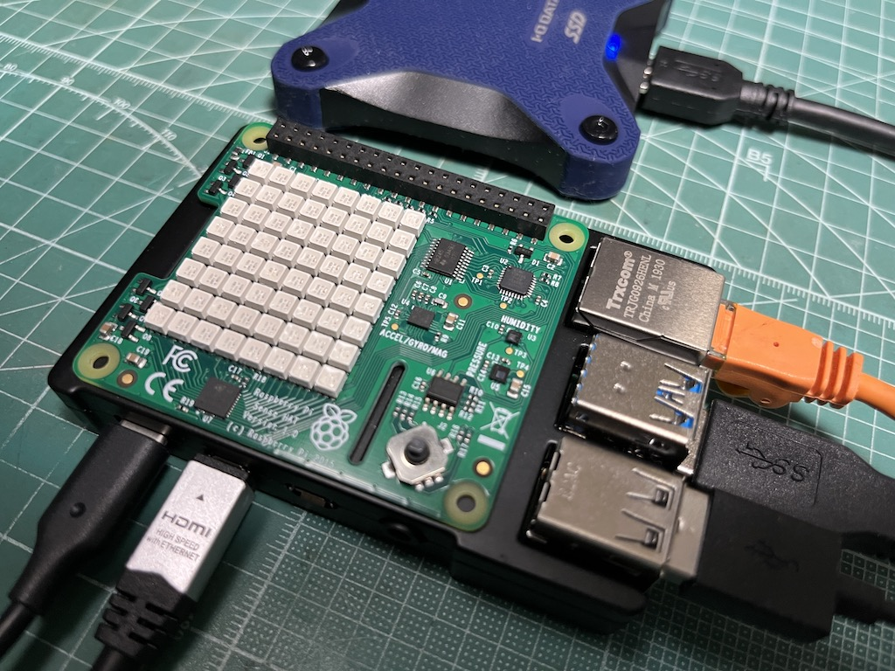

The [uecho-rs](https://github.com/cybergarage/uecho-rs) is a portable, cross-platform development framework for Rust developers to create [ECHONET-Lite][enet] controller and device applications.
The repository provides an example implementation of [ECHONET-Lite][enet] device using the [uecho-rs](https://github.com/cybergarage/uecho-rs) on [Raspberry Pi Sense HAT](https://www.raspberrypi.com/products/sense-hat/).

The [ECHONET-Lite][enet] example simulates the following standard devices which are defined by [Machine Readable Appendix][mra] provided by [the ECHONET Consortium][eneto] using Sense HAT sensors.

- Temperature sensor class (0x0011)
- Humidity sensor class (0x0012)
- Air pressure sensor class (0x002D)
- Mono functional lighting (0x0291)

## References

- [Raspberry Pi Sense HAT](https://www.raspberrypi.com/products/sense-hat/)
- [Raspberry Pi Documentation - Sense HAT](https://www.raspberrypi.com/documentation/accessories/sense-hat.html)

[enet]:http://echonet.jp/english/
[eneto]:https://echonet.jp/organization_en/
[mra]:https://echonet.jp/spec_mra_rp1_en/
[mcl]:https://echonet.jp/spec-en/
